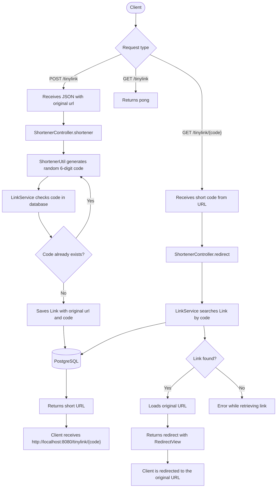

# TinyLink API

[🇺🇸](README.md) [🇧🇷](README.pt.md)

A simple and efficient URL shortener API built with Java.

## Technologies

- **Java 20**
- **Spring Boot:** Used to build the API quickly.
- **PostgreSQL:** Database used to persist links.
- **JPA / Hibernate:** Object-relational mapping with the database.
- **Maven:** Dependency manager.

## Architecture Overview

The project follows a simple layered architecture:

- **Controller:** receives HTTP requests at `/tinylink`, creates short URLs, and handles redirects.
- **Service:** centralizes access to link persistence operations.
- **Repository:** uses Spring Data JPA to query and save links in PostgreSQL.
- **Model:** represents the `Link` entity, composed of the original `url`, the short `code`, and an `id`.
- **Util:** contains the short code generation strategy.

## Flowchart



## Running the Project

1.  **Prerequisites:**
    - Docker.
    - Docker Compose.
    - Git.

2.  **Clone the repository:**

    ```bash
    git clone https://github.com/evandrohenrique01/TinyLink.git
    cd TinyLink
    ```

3.  **Start the application with Docker Compose:**

    ```bash
    docker compose up --build
    ```

    This command creates and starts:
    - **api-java:** Spring Boot API container.
    - **db-postgres:** PostgreSQL container with the `tiny_link` database.

4.  **Access the API:**
    - The API will be available at `http://localhost:8080`.
    - To check whether the application is responding:
        ```bash
        curl http://localhost:8080/tinylink
        ```

5.  **Stop the containers:**
    ```bash
    docker compose down
    ```

### Local Execution

If you want to run the API outside Docker, configure a local PostgreSQL instance with the `tiny_link` database and define the expected variables in `api/src/main/resources/application.properties`:

- `DATABASE_URL`
- `DB_USERNAME`
- `DB_PASSWORD`

Then run the application through the `ApiApplication.java` class or with Maven inside the `api` directory.

## API Usage

### 1. Shorten a URL

Send a **POST** request to `/tinylink` with the original URL in the request body.

- **Endpoint:** `POST /tinylink`
- **Request Body (JSON):**
    ```json
    {
        "url": "https://www.google.com/search?q=computer+engineering"
    }
    ```
- **Successful Response Example:**

    ```text
    http://localhost:8080/tinylink/482913
    ```

- **`curl` example:**
    ```bash
    curl -X POST http://localhost:8080/tinylink \
      -H "Content-Type: application/json" \
      -d '{"url":"https://www.google.com/search?q=computer+engineering"}'
    ```

### 2. Access the Original URL

Open the `shortUrl` returned in the previous step directly in your browser.

- **Endpoint:** `GET /tinylink/{code}`
- **Example:** accessing `http://localhost:8080/tinylink/482913` in the browser redirects to the original URL.

### 3. Health Check

- **Endpoint:** `GET /tinylink`
- **Response:**
    ```text
    pong
    ```

## Short URL Generation Strategy

The short URL is based on a random 6-digit numeric code.

1. The API receives the original URL in the request body.
2. `ShortenerUtil` generates a random number between `111111` and `999999`.
3. Before saving, the code is checked in the database to verify whether it already exists.
4. When the code is available, the API saves a new record with:
    - `url`: original URL.
    - `code`: generated short code.
5. The response returns the short URL in the following format:
    ```text
    http://localhost:8080/tinylink/{code}
    ```

## Redirect Flow

When a short URL is accessed:

1. The client sends a `GET /tinylink/{code}` request.
2. The controller receives `{code}` from the URL.
3. `LinkService` searches the database for the record associated with the code.
4. The original URL is loaded.
5. The API returns a redirect to the original URL using `RedirectView`.

Example:

```text
GET http://localhost:8080/tinylink/482913
```

Redirects to:

```text
https://www.google.com/search?q=computer+engineering
```
