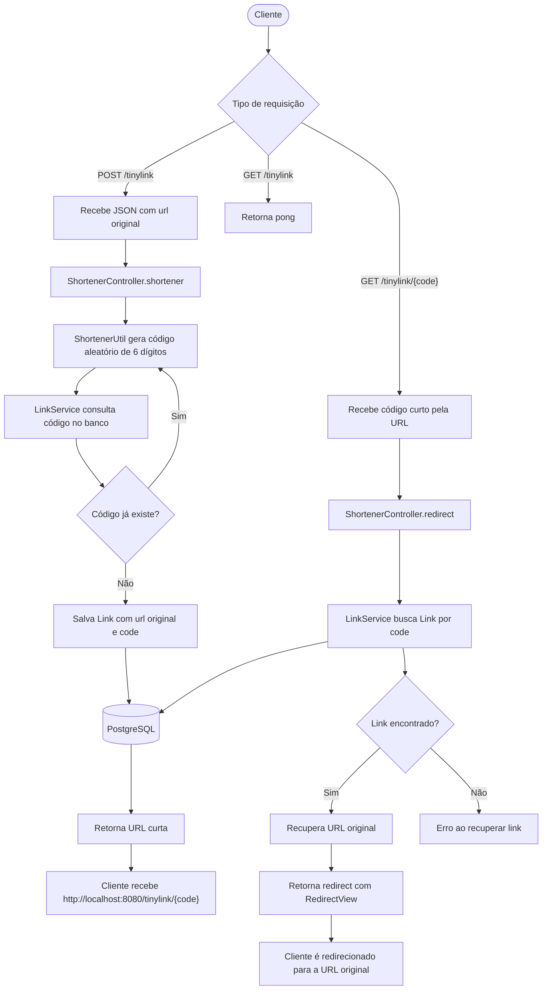

# TinyLink API

[🇺🇸](README.md) [🇧🇷](README.pt.md)

Uma API simples e eficiente para encurtamento de URLs, desenvolvida com Java.

## Tecnologias Utilizadas

- **Java 20**
- **Spring Boot:** Para a criação rápida da API.
- **PostgreSQL:** Banco de dados para persistência dos links.
- **JPA / Hibernate:** Para o mapeamento objeto-relacional com o banco de dados.
- **Maven:** Gerenciador de dependências.

## Arquitetura Resumida

O projeto segue uma arquitetura simples em camadas:

- **Controller:** recebe as requisições HTTP em `/tinylink`, cria URLs curtas e executa redirects.
- **Service:** centraliza o acesso às operações de persistência dos links.
- **Repository:** usa Spring Data JPA para consultar e salvar links no PostgreSQL.
- **Model:** representa a entidade `Link`, composta por `id`, `url` original e `code` curto.
- **Util:** contém a estratégia de geração do código curto.

## Fluxograma



## Como Executar o Projeto

1.  **Pré-requisitos:**
    - Docker.
    - Docker Compose.
    - Git.

2.  **Clone o repositório:**

    ```bash
    git clone https://github.com/rodriguesxxx/TinyLink.git
    cd TinyLink
    ```

3.  **Suba a aplicação com Docker Compose:**

    ```bash
    docker compose up --build
    ```

    Esse comando cria e inicia:
    - **api-java:** container da API Spring Boot.
    - **db-postgres:** container PostgreSQL com o banco `tiny_link`.

4.  **Acesse a API:**
    - A API estará disponível em `http://localhost:8080`.
    - Para validar se a aplicação está respondendo:
        ```bash
        curl http://localhost:8080/tinylink
        ```

5.  **Parar os containers:**
    ```bash
    docker compose down
    ```

### Execução Local

Caso queira executar a API fora do Docker, configure um PostgreSQL local com o banco `tiny_link` e defina as variáveis esperadas em `api/src/main/resources/application.properties`:

- `DATABASE_URL`
- `DB_USERNAME`
- `DB_PASSWORD`

Depois execute a aplicação pela classe `ApiApplication.java` ou pelo Maven dentro da pasta `api`.

## Como Usar a API

### 1. Encurtar uma URL

Envie uma requisição **POST** para `/tinylink` com a URL original no corpo da requisição.

- **Endpoint:** `POST /tinylink`
- **Corpo (Body) da Requisição (JSON):**
    ```json
    {
        "url": "https://www.google.com/search?q=engenharia+de+computacao"
    }
    ```
- **Resposta de Sucesso (Exemplo):**

    ```text
    http://localhost:8080/tinylink/482913
    ```

- **Exemplo com `curl`:**
    ```bash
    curl -X POST http://localhost:8080/tinylink \
      -H "Content-Type: application/json" \
      -d '{"url":"https://www.google.com/search?q=engenharia+de+computacao"}'
    ```

### 2. Acessar a URL Original

Basta acessar a `shortUrl` retornada no passo anterior diretamente no seu navegador.

- **Endpoint:** `GET /tinylink/{code}`
- **Exemplo:** acessar `http://localhost:8080/tinylink/482913` no navegador redireciona para a URL original.

### 3. Health Check

- **Endpoint:** `GET /tinylink`
- **Resposta:**
    ```text
    pong
    ```

## Estratégia de Geração de Short URLs

A URL curta é baseada em um código numérico aleatório de 6 dígitos.

1. A API recebe a URL original no corpo da requisição.
2. O `ShortenerUtil` gera um número aleatório entre `111111` e `999999`.
3. Antes de salvar, o código é consultado no banco para verificar se já existe.
4. Quando o código está disponível, a API salva um novo registro com:
    - `url`: URL original.
    - `code`: código curto gerado.
5. A resposta retorna a URL curta no formato:
    ```text
    http://localhost:8080/tinylink/{code}
    ```

## Fluxo de Redirects

Quando uma URL curta é acessada:

1. O cliente faz uma requisição `GET /tinylink/{code}`.
2. O controller recebe o `{code}` pela URL.
3. O `LinkService` busca no banco o registro associado ao código.
4. A URL original é recuperada.
5. A API retorna um redirect para a URL original usando `RedirectView`.

Exemplo:

```text
GET http://localhost:8080/tinylink/482913
```

Redireciona para:

```text
https://www.google.com/search?q=engenharia+de+computacao
```
